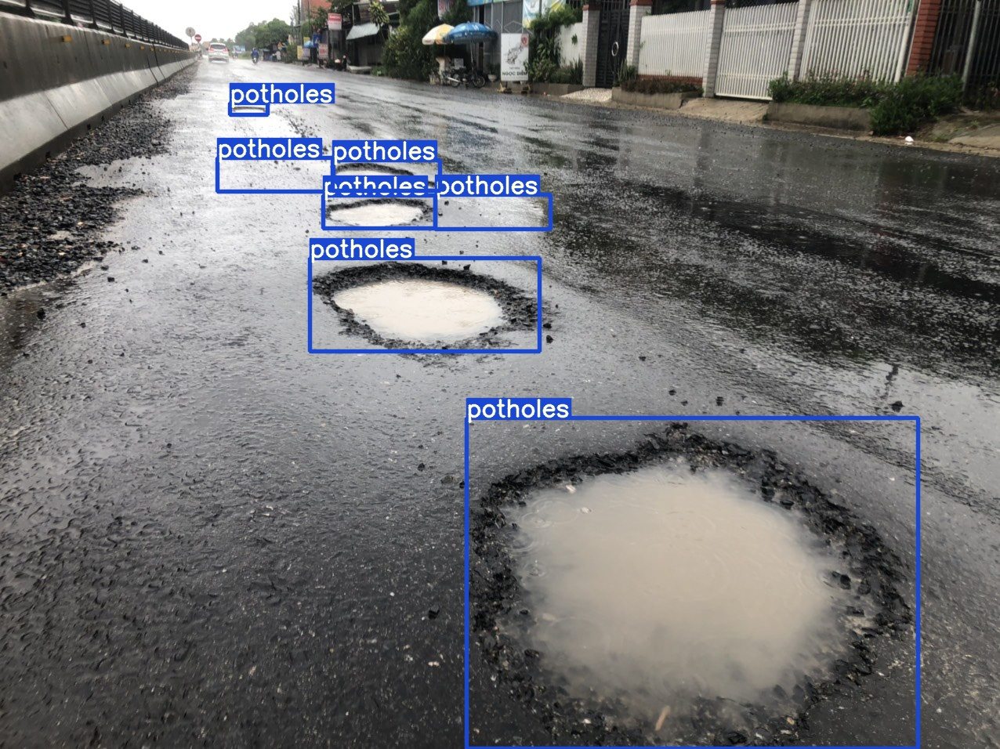
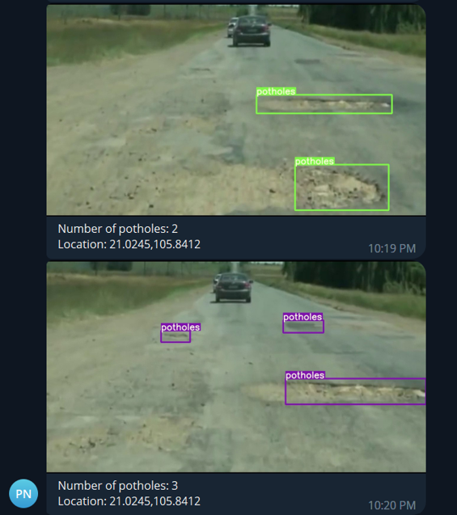

# Potholes detection using YOLOv7
<a href="https://colab.research.google.com/gist/AlexeyAB/b769f5795e65fdab80086f6cb7940dae/yolov7detection.ipynb"></a>

<div align="center">
    <a href="./">
        
    </a>
</div>

## How to run

### Clone the repository

```
git clone https://github.com/ttrung2h/AIP391_YOLOV7_Potholes-Detection-System.git
```

### Install requirements

```
pip install -r requirements.txt
``` 

### Download and setup weights

```
mkdir weights
cd weights

wget https://github.com/ttrung2h/AIP391_YOLOV7_Potholes-Detection-System/download/best.pt
```

### Detect potholes from image

```
python3 DetectFromImage.py --weight [path to weight] --image [path to image] --resultimage [path to result]
```
**Example:**
```
python3 DetectFromImage.py --weight weights/best.pt --image test_image/demo.jpg --resultimage result_image
```


### Detect potholes from video
* Detect potholes from video only work in local machine. You can't run it in Google Colab.

* You can detect potholes from video by using DetectFromVideo.py. If you want to send information through Telegram bot, you need to provide bot token and chat id.
    
```
python3 DetectFromVideo.py --weight [path to weight] --video [path to video] --trackingfolder [path to save result in frame] --bottoken [token of telegram bot] --chatid [chat id you want to send message]
```

* **Example:**
```
python3 DetectFromVideo.py --weight weight/best.pt --video test_video/demo.mp4 --trackingfolder tracking_data 
```



